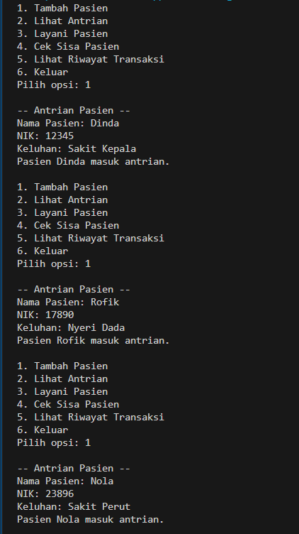
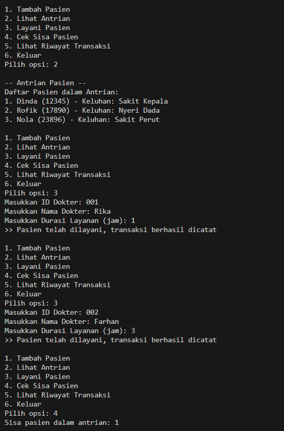
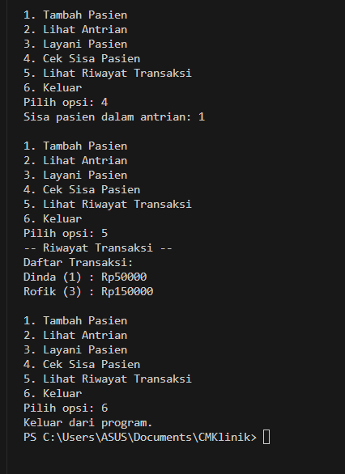

|  | Algoritma dan Struktur Data|
|--|--|
| Kelompok | 4|
| Nama / NIM |  Muhammad Fattahul Alim / 244107020018|
|            |  Sahrul Ramadhani / 244107020058|
|            |  Tri Desti Sasmita / 244107020167|
| Kelas | TI - 1H |
| Repository |https://github.com/FattahulAlim/Case-Method-Klinik-Kel4|

# Case Method Klinik 

Hasil Praktikum: 
---

---

---

---
